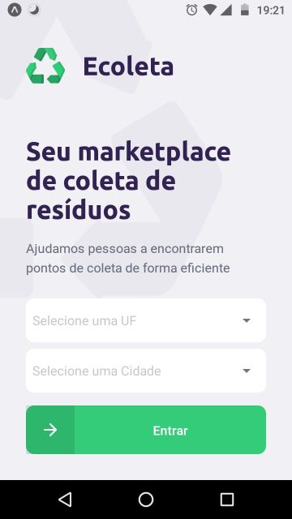
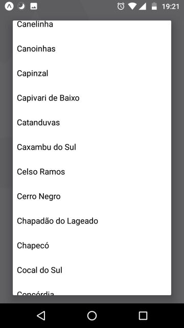
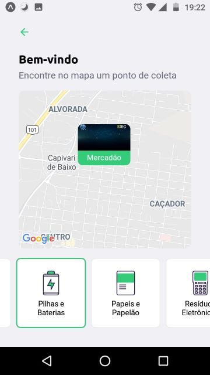
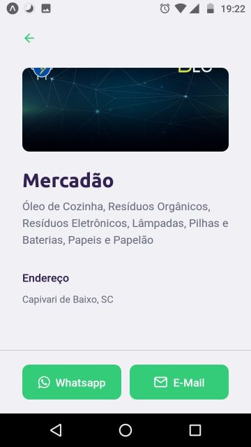

# Ecoleta App

Este é o App Mobile do Ecoleta, um aplicativo que une a pessoa que deseja descartar um resíduo com entidades da sua região capazes de fazer a coleta eficiente do mesmo.

Neste aplicativo, o usuário informa seu estado e cidade, e com base nestas informações a aplicação mostra as entidades presentes na região capazes de realizar a coleta de resíduos. O usuário pode visualizar estas entidades em um mapa, filtrá-las de acordo com os itens que deseja descartar, e por fim contactá-las diretamente via *whatsapp* ou e-mail.

## 1. Telas

   

### 1.1 Home

A tela inicial é apenas a tela de apresentação. Nela, você pode escolher o seu estado e cidade para filtrar os pontos de coleta.

*OBS: Ambos UF e Cidade são preenchidos automaticamente com os dados da API do IBGE.*

Ao clicar em **Entrar**, o usuário é direcionado para a tela do mapa.

### 1.2 Mapa

Na tela de Mapa, o usuário pode visualizar o mapa da região, com marcadores sinalizando os pontos de coleta próximos.

Abaixo, há um filtro por itens de coleta. Os marcadores só aparecem quando há itens selecionados, e assim que o usuário se interessa por um ponto de coleta, ele pode clicar no marcador para ser direcionado a tela de detalhes.

### 1.3 Detalhes

Na seção de detalhes, o usuário pode visualizar todas as informações do ponto de coleta, tais como seu nome, todos os itens que ele coleta, e seu endereço.

Por fim, o usuário pode entrar em contato diretamente via whatsapp ou e-mail, clicando nos botões no rodapé da tela.

## 2. Sobre o App

O App foi desenvolvido em React Native, utilizando o [Expo](https://expo.io/) para facilitar o desenvolvimento, além das opções que ele proporciona para acesso das ferramentas do dispositivo.

Além disso, as seguintes bibliotecas foram utilizadas:

- **[Axios:](https://www.npmjs.com/package/axios)** Um cliente HTTP baseado em Promises, o Axios foi utilizado para realizar as diversas chamadas a API.
- **[React Navigation:](https://reactnavigation.org/)** Pacote com **diversas** ferramentas para realizar o roteamento de telas no aplicativo, adequeando seu comportamento de acordo com o sistema operacional e outros fatores.
- **Ferramentas do Expo:** O próprio Expo disponibiliza diversas ferramentas em pacotes a parte. Você pode ver quais estão disponíveis na [documentação do Expo](https://docs.expo.io/).
  - **Expo Font:** Pacote para a importação de maneira fácil de fontes externas da aplicação.
  - **Expo Constants:** Pacote que disponibiliza várias constantes de acordo com o sistema operacional onde o app está rodando. Usado para alguns ajustes de layout.
  - **Expo Location:** Pacote para a utilização de mapas e outras ferramentas de geolocalização no app.
  - **Expo Mail Composer:** Pacote que habilita a criação de e-mails direto do app, já realizando o *deep linking* com o aplicativo de e-mail padrão instalado no smartphone.
- **[React Native Picker Select:](https://www.npmjs.com/package/react-native-picker-select)** Um componente que emula os inputs do tipo *select* em Android e iOS. Utilizado para a seleção de UF e cidade na tela inicial.
- **[React Native SVG:](https://www.npmjs.com/package/react-native-svg)** Um pacote que permite que o app se torne compatível com o uso de SVGs.
