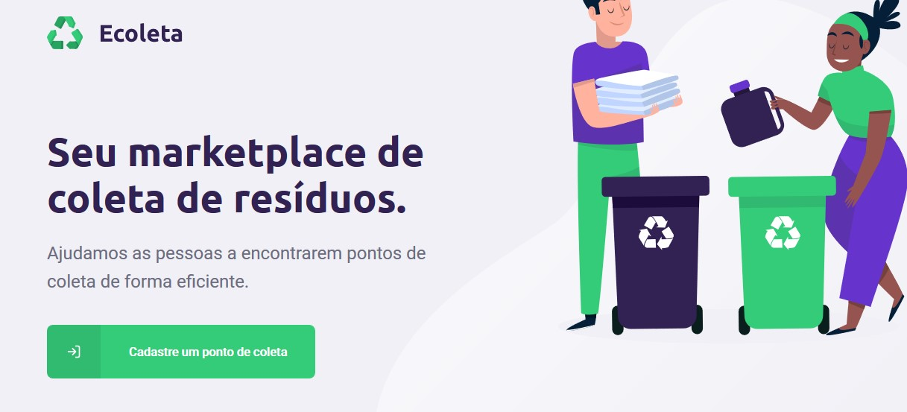
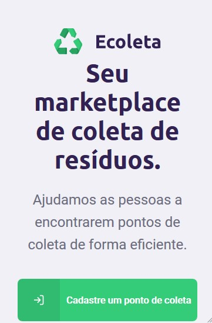
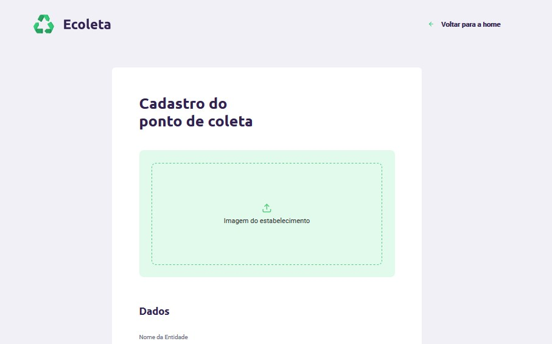
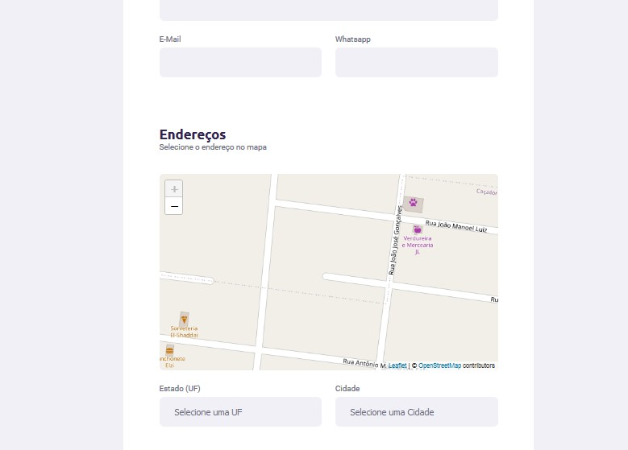
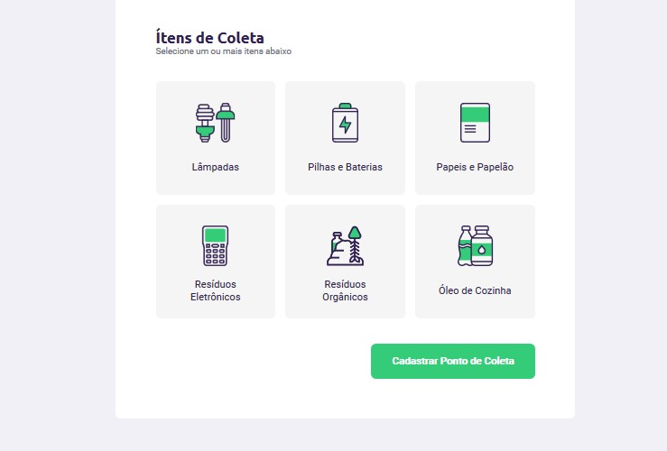
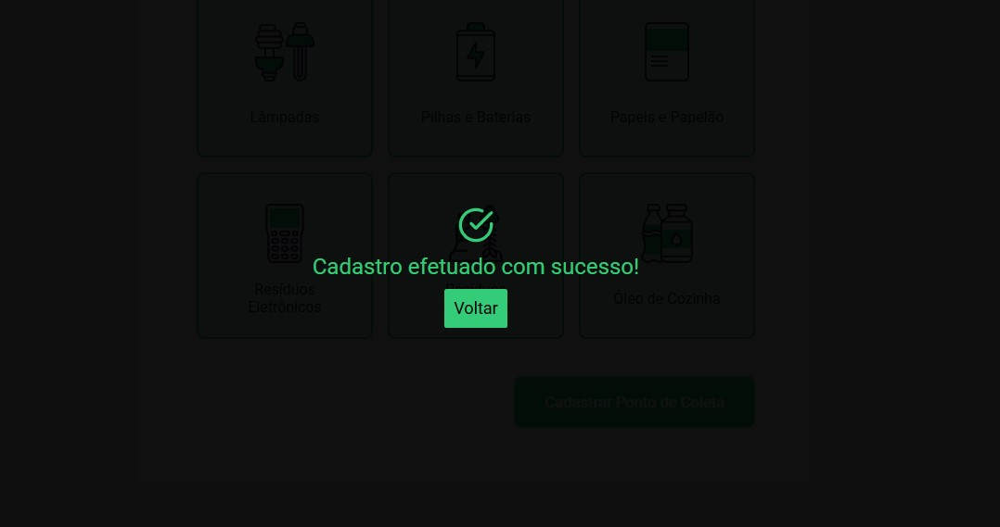
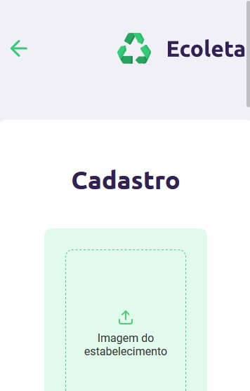
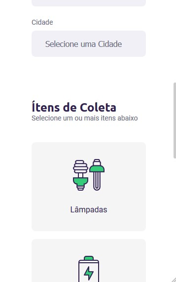

# Ecoleta Web

Este sistema desenvolvido em ReactJS tem como objetivo cadastrar, na API do Ecoleta, os pontos de coletas de resíduos da região.

Acessando o sistema, o usuário pode cadastrar um ponto colocando suas informações e localização.

## 1. Telas

### 1.1 Home

 

Esta é a tela de boas vindas da aplicação, apresentando o objetivo o Ecoleta. Ao clicar no botão, o usuário é redirecionado para a tela de cadastro de ponto de coleta.

### 1.2 Criar Ponto

Na página de cadastro de pontos, o usuário pode cadastrar o ponto de coleta na base de dados da aplicação. Para tal, ele precisa informar:

- O nome da entidade de coleta
- Seu e-mail
- Seu número de whatsapp
- Seu estado
- Sua cidade
- Sua localização no mapa
- Uma imagem da entidade
- Quais dos itens ela coleta

Os itens coletáveis são fornecidos pela API, e as opções de uf e cidade são fornecidas automaticamente pela API do IBGE.

Além disso, o usuário pode selecionar a localização da entidade clicando no exato ponto do mapa.

Ao finalizar o preenchimento dos dados, o usuário pode clicar no botão **Cadastrar Ponto de Coleta**, que submeterá o cadastro na aplicação.
A seguinte tela aparecerá para confirmar o cadastro:

Abaixo, seguem as imagens da aplicação vista de um smartphone:

 

## 2. Sobre a Aplicação

A aplicação foi desenvolvida em ReactJS utilizando o [Create React App](https://create-react-app.dev/) para preparar o ambiente de desenvolvimento e cuidar do ambiente de produção. 

Além disso, as seguintes bibliotecas foram utilizadas:

- **[Axios:](https://www.npmjs.com/package/axios)** Um cliente HTTP baseado em Promises, o Axios foi utilizado para realizar as diversas chamadas a API.
- **[Leaflet:](https://leafletjs.com/)** Leaflet é uma biblioteca *open-source* para a utilização de mapas interativos, usada nessa aplicação para mostrar o mapa da região e permitir ao usuário informar a localização do ponto de coleta. Para integrá-lo com o React, foi usado o pacote [React Leaflet](https://react-leaflet.js.org/).
- **[React Dropzone:](https://react-dropzone.js.org/)** Pacote que disponibilizou o componente de *Drag and Drog*/seleção de arquivos usado na aplicação para envio de imagem.
- **[React Icons:](https://react-icons.github.io/react-icons/)** Pacote que abstrai as diversas bibliotecas de ícones existentes (FontAwesome, Feather Icons, Material Icons, etc) e as disponibiliza inteiramente em um único lugar.
- **[React Loading:](https://www.npmjs.com/package/react-loading)** Pacote que disponibiliza componentes com ícones de carregamento em SVG. Utilizado como componente para o *fallback* do Suspense, componente que foi utilizado para realizar o *lazy loading* dos componentes de rotas da aplicação.
